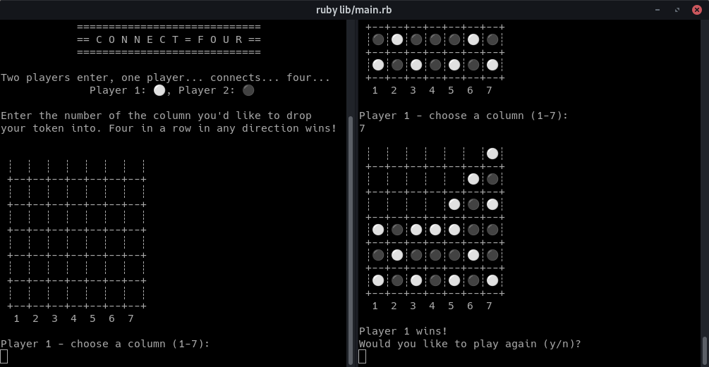

# The Odin Project - Connect Four (TDD)

## Description

A CLI version of Connect Four, a game where the objective is to outmaneuver your opponent to get four tokens in a row on a 7x6 grid.

## Process

This project was intended primarily as an introduction to *Test-Driven Development* and `rspec`.  The game itself is simple and was done in a relatively straightforward fashion.  Iterating through the board grid to find diagonals was the only major sticking point I came across with the game logic itself.  Pattern matching in Ruby 3.0 continues to be pretty damn handy in these small projects.

As for TDD, I found writing tests for everything before coding to be rather tedious and disruptive to flow compared to just getting straight into things and doing quick unit tests on an as-needed basis.  I'm inclined to chalk this up mostly to being new to `rspec` and needing to get better at writing easily testable code to take adv of it.  I can, of course, see the advantages to TDD if this were a larger project where refactoring was more of a necessity.

## A Note on AI Solving

Although I didn't write a CPU opponent for this project, I was interested to discover that Connect Four is technically a *solved* game.  The first player will always win before the board fills up if their first turn is the middle column and they play perfectly.  Opening moves further from the center are increasingly disadvantageous.

[The Fhourstones Benchmark](https://tromp.github.io/c4/fhour.html) can solve any position of the game.
